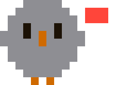

<div align="center">


# Roost

**Your agent sessions, perched on the notch.**

A macOS menu-bar companion that answers one question from the corner of your eye:
*which of my agent sessions has stopped and is waiting on me?*


<a href="https://linux.do/u/amigoer"></a>

**English** · [简体中文](README.zh-CN.md)

</div>


---

## Why

A long agent session does not fail loudly. It asks a question, raises a permission
prompt, or quietly stalls on a tool — and then waits, in a window you tabbed away
from twenty minutes ago. The cost is not the failure; it is the twenty minutes.

Roost keeps exactly that one fact where you already look: the notch. Nothing is
happening? The notch stays the notch. Something needs you? It grows.

## The chick

One mascot, six faces, on a 15×12 pixel grid. The body wears the state's colour,
so a glance answers *what is going on* before any glyph has to be read; the
silhouette and the orange beak carry the identity. The eyes and the badge in the
top-right corner say exactly which state it is.

| | State | Badge | What it means |
|:--:|:--|:--:|:--|
|  | `running` | blue, no badge | Producing output or running a tool. Cool and receding, because work in progress is the least of your worries. Hops one pixel, once per second. |
|  | `waiting` | orange **?** | Stopped on something only you can answer: a question, a plan, a permission prompt. Brand orange is spent here and nowhere else. |
|  | `stalled` | red **!** | A tool call has been outstanding past the grace period. |
|  | `done` | green **✓** | The turn ended. Nothing is burning. |
|  | `error` | red **✕** | Something failed. |
|  | `idle` | grey **z** | Left alone long enough to be clutter. Folded into a single footer line. |
|  | `spent` | red **—** | A quota window has run out, and every session is stopped on something no session can fix. No new ink: grey already means nothing is moving and red already means it matters. |

The same mark appears on the collapsed island and on every row of the expanded
list, and the two never disagree. There is deliberately **no menu bar item** —
one more icon up there is the clutter this app exists to remove.

## Anatomy of a row

```
✳  perch · SVG 素材实现                          🐤  3m
   asked you a question
```

| Part | Says |
|:--|:--|
| Agent mark | Whose session it is: Claude Code's terminal creature, or Codex's ring. Shape carries it, because the mascot beside it is already spending colour on the state. The Claude one is its published mark cell for cell — that mark is drawn on a 1.5-unit step inside a 24-unit box, so it lands on this app's grid exactly rather than having to be redrawn to look like it. |
| `project · title` | Which repo, then which conversation. The repo answers "do I care" faster. |
| Second line | What it is doing *right now*: the tool, then the argument a person would recognise — the command, the file, the pattern — pulled straight out of the transcript. Blocked rows say why instead. |
| Model | What it is running, from the desktop app's own record of the session. |
| Mascot | The state, with the badge that says which kind of stop it is. |
| Elapsed | Blocked rows count how long they have been stuck. Everything else counts how long since anything happened, which is what makes a stale session obvious. |

## Answering from the island

A permission prompt can be answered without leaving what you were doing. Roost
installs a `PermissionRequest` hook; Claude Code holds the tool call while the
hook asks Roost, and the island shows the call with **Deny** and **Allow**.


Turn it on in Settings — *Answer permission prompts in the island*. That adds
two entries to `~/.claude/settings.json` pointing at the `roost-hook`
binary inside the app bundle. The same switch takes both back out, and hooks that
are not Roost's are never touched.

Failure is deliberately boring. If Roost is not running, if the socket is gone,
if nobody answers within 60 seconds — the hook prints nothing and the session
prompts exactly as it always did. This can make a tool call wait. It cannot
change what one does.

| Event | Carries |
|:--|:--|
| `PermissionRequest` | Every tool call that was about to raise a prompt — whatever the tool, whatever the session's permission mode. Nothing else ever fires it, and a session with no way to prompt (`claude -p`) never raises it at all: that one fails on its own rather than waiting for anybody, so it has no business on the island. |
| `PreToolUse` | Only `AskUserQuestion` and `ExitPlanMode`: the two calls that stop a session without being permissions at all, which no permission event fires for. Every other call it brings is dropped inside the hook, so the common path costs one set lookup and no round trip. |

`PermissionRequest` runs where a prompt is about to appear and nowhere else, so
whatever reaches the island *was* a prompt. There is nothing to work out and
nothing to filter.

Earlier versions had only `PreToolUse`, which fires for every call whether it
would have prompted or not, and made up the difference by reading each session's
permission mode off disk — from the transcript, which records the mode of every
turn, and failing that from the desktop app's record — and guessing from it.
That guess is gone, and with it the whole class of cards for calls nobody was
ever going to be asked about.

While a call is held, the row for that session says so instead of reading as
busy: **needs permission: Bash**, or **general-purpose needs input** when the
call came from inside a sub-agent rather than from the main thread. The event
carries `agent_id` and `agent_type` in exactly that case and in no other, which
is what the row reads to tell the two apart. Claude Code writes nothing to the
transcript when it prompts, so the hook is the only thing that can know, and the
row and the fleet headline would otherwise both count the session as running.

The island is click-through by design, so the buttons are geometry on both
sides: the card lays them out from the same constants the hit test reads. That
mapping is [tested](Packages/RoostCore/Tests/RoostCoreTests/ApprovalTests.swift),
because clicking the wrong half of a card would answer the wrong question.

### Questions and plans

The same hook carries two more things a session can be stopped on, and neither
of them is a permission.

**A question.** `AskUserQuestion` arrives with its options and the card lists
them as rows; clicking one sends it back. There is no hook decision that means
*here is the answer*, so the pick goes back as a denial whose reason is the
chosen label — which is exactly what the model reads next. Held in every
permission mode, because none of them answers a question: `bypassPermissions`
skips prompts, it does not decide which deploy target you meant. Anything the
card cannot answer in full — several questions at once, a multi-select, an
option that would not parse — is left to prompt the way it always did.

**A plan.** `ExitPlanMode` arrives with the plan, and the card shows the top of
it with **Revise** and **Approve**. Approving lets the call run, which is
exactly what the terminal's own plan prompt does; revising denies it and leaves
the session in plan mode with an instruction to ask what to change, because the
island has nowhere to type feedback and would rather say so than invent any.

Six flattened lines rather than rendered markdown: at this width a heading
hierarchy costs more than it carries, so the markup is spent on getting more of
the plan's own words on screen. The card says how many lines it could not show,
and the conversation still has all of them.

### More than one agent

Codex speaks the same hook protocol — the same event names, the same payload
fields, a hooks file in a different place — so the same helper serves it, told
which agent it is standing in for. Turn it on under *Agents*.

Permissions work identically: the same `PermissionRequest` event, the same card,
an answer in the same `{"behavior": …}` shape. Codex has no `AskUserQuestion` and
no plan mode, so its `PreToolUse` is spent on something else entirely.

What differs is everything around it. Codex writes no registry of live sessions
and no transcript that says what is happening *now*, so a row for one is
assembled from the events it announces — started, prompted, reached for a tool,
finished — rather than read off disk. A tool call with nothing after it goes
stalled on the same grace period a transcript would.

## How it reads state

No daemon, no account, no telemetry. Roost reads files you already have:

| Source | Used for |
|:--|:--|
| `~/.claude/sessions/*.json` | Which sessions are live. A registry file outlives its process, so each PID is confirmed against the kernel's own process start time. |
| `~/.claude/projects/**/<id>.jsonl` | The last 256 KB of the transcript: the dangling tool call, the last stop reason, the last semantic timestamp. |
| `~/Library/Application Support/Claude/claude-code-sessions/local_*.json` | Human titles, when the session came from the desktop app. |

Nothing is written to the transcript at the moment a prompt appears, so a
dangling tool call plus elapsed time is the only evidence available:

- `AskUserQuestion` and `ExitPlanMode` are, by definition, waiting on a person —
  they count as blocked the instant they are seen.
- Every other tool gets a **45 second** grace period first, because a long build
  is not a blocked session.
- Transcripts are parsed only when the file's modification date changes; state is
  re-derived from cached facts every tick, so a tool crossing the grace line is
  noticed without re-reading anything.

Sessions that have been `done` for **30 minutes** stop being listed and collapse
into an `N idle` footer. Sessions Roost hears about only through hooks are
forgotten after **12 hours** of silence, since an agent killed rather than
closed sends no `SessionEnd`.

### The usage windows

Two switches, because there are two paths to the same two figures and they cost
different things.

A status line is the only place the numbers appear locally — not the
transcripts, not the stats cache — so *Read the figure from your status line*
installs a status line command that **wraps** whatever is already configured:
the same payload goes to its stdin, its output is printed through unchanged,
and the entry Roost writes carries the original base64'd in its own arguments.
Switching it off restores that exactly, from the settings file alone, whether or
not Roost is running. What it cannot do is report when nothing is drawing a
status line — which is the desktop app, and any Mac between sessions.

*Ask Anthropic what is left* covers that, and is the only thing Roost sends
anywhere besides the update check. About once a minute it asks
`api.anthropic.com` for your own account's figures, using the token Claude Code
already keeps in your keychain. The token is read and never written: Claude Code
owns that keychain item and rotates it on its own schedule, and two processes
racing for one entry is a broken login for the sake of a number in a footer. An
expired token is simply no credential, and the status line reading stands until
Claude Code next rotates it. Nothing about your sessions goes with the request.
It is off until you turn it on, and reading the token raises a keychain prompt
the first time and again after an update.

Both windows show as ten-cell tracks along the footer, drawn on the grid the
chick is drawn on: the question is how many cells are left, and cells are
countable where a bar is not. Hovering them spells the reset times out along the
whole strip, with the per-model weeklies after them.

A reading nothing has refreshed for a while is dimmed and dated rather than
hidden. Someone opening the island to ask how much is left is worse served by
nothing at all than by a number and the hour it was true, and a window whose
reset has since passed says so rather than showing a figure that has moved on.

Inside twenty percent of full, the window takes the header's headline off the
count of what is running, because it is the thing that will stop all of it —
and it says when it comes back rather than how much has gone. Spent, with work
still on the machine, it grows the collapsed island, the chick wears the face
above, and the countdown stands where the count would be.

Besides that poll, the one request Roost makes is an update check against
GitHub's releases API, every six hours, sending nothing but the request itself.
A newer version puts a dot on the gear and a line in the footer; installing it
stays manual, because an ad-hoc signed build has no signature worth checking.
Switch the check off under *Check automatically*.

## Sound

Two chirps, off until switched on. Synthesised square waves rather than bundled
audio, for the same reason the mascot is a pixel grid: it is the idiom the app
already speaks, and at a third of a second nobody wants a sample.

Pitch carries the meaning — rising when a session stops on something only a
person can answer, falling when a turn ends — so the two are told apart across a
room without being listened to. Both sit well under full scale: a sound that has
to be turned down is one that gets turned off.

The decision comes from the difference between two scans rather than from
events, so a session moving between two kinds of blocked stays quiet, and the
first snapshot after launch says nothing at all — everything in it was already
true before Roost opened.

## Escalation

While something is blocked, the island widens on a timer — 60 s, then 300 s. The
badge blinks at one fixed rate throughout, because animation *frequency* is what
disrupts a primary task; width is what peripheral vision actually picks up.

## Design rules

The code enforces these, and the comments say so:

1. **Only blocked grows.** A change of shape at the notch carries exactly one
   meaning and never has to be interpreted.
2. **Hue is the state, the silhouette is the identity.** One colour per state,
   never a gradient of urgency within one; the pixel outline and the orange beak
   are what stay constant.
3. **Nothing is drawn in the cutout.** The camera's rectangle is reserved, always.
4. **Clicks meant for the menu bar are never swallowed.** The panel ignores mouse
   events entirely; hover and clicks come from a global monitor against a hit rect.
5. **Frames are free.** All motion is Core Animation on the render server. A
   `repeatForever` SwiftUI animation re-evaluates the view tree every frame and
   measured at 13–16 % CPU sustained, which an always-on app cannot spend.

## Interaction

- **Hover** the notch to expand the list (up to 6 rows).
- **Click a row** to land where that session actually is. A session is a CLI
  process with no window of its own, so Roost climbs its process tree: the
  first ancestor macOS considers a running application is the window it is
  sitting in — Terminal, iTerm2, Ghostty, Warp, an editor's built-in one. The
  shells and helpers in between are skipped by activation policy, which is what
  makes this work without a list of terminal names to keep current.
- A conversation the **desktop app** started can do better than being raised, so
  it still gets `claude://resume?session=…` —
  the one route in that works from outside. What it does turns entirely on the
  id it is handed: it puts `local_` back on the front and focuses the record it
  finds under that id. The desktop app's own id for a conversation lands on the
  original. A CLI session id matches nothing for a conversation the app started,
  so it imports the transcript as a second entry beside it — and that copy is a
  session of its own, which holds a second process against the same transcript
  once opened. Roost sends the app's own id whenever there is one, and the CLI
  id only where there is no record at all: a session started in a terminal,
  where the import is how it reaches the app in the first place.
- The other two routes, `code/continue` and `code/needs-input`, take the app's
  own id too but sit behind an account gate that logs `code entry deep link
  gated off` and does nothing else.
- **Click Deny or Allow** on a held tool call, **an answer** on a held question,
  or **Revise or Approve** on a plan. The island stays open on its own while one
  is waiting, so answering never depends on the cursor being there.
- **Click the gear** in the panel's top-right for settings. Right-clicking the
  notch offers the same window plus Quit, which is what to reach for when the
  island is collapsed and there is nothing to point at.
- Displays without a notch get a 185 pt stand-in strip, centred where a notch
  would be.

## Settings


Every switch is shown above; the window itself is shorter than that and
scrolls, so nothing is hidden by the fold. The shot is generated from the real
view by `scripts/settings-screenshots.sh`, which is what stops it drifting from
what the app actually says.

Everything worth choosing lives here, each switch with the sentence that says
what it actually does: whether to check for updates and whether to open at
login, which language the interface speaks, whether to answer permission
prompts from the island, whether to watch Codex as well, whether to say a state
change out loud, and which of the two paths to the usage windows to use. It is also the way out — an accessory app has no Dock icon to quit
from.

Every switch that touches a file writes it additively and takes it back out the
same way: hooks that are not Roost's are never touched, and a status line that
is not Roost's is carried rather than replaced.

Language follows your Mac until you pick English or 简体中文 yourself. The switch
lands immediately and everywhere, island included.

Nothing here sets the island's state. State is derived from what the sessions
are actually doing, and a switch that overrode it would only ever be lying.

## Install

Take the DMG from [Releases](https://github.com/amigoer/roost/releases) and drag
Roost into Applications. The build is ad-hoc signed rather than notarised, so
macOS refuses the first launch — right-click the app and choose Open, or:

```bash
xattr -dr com.apple.quarantine /Applications/Roost.app
```

Requires macOS 14 or later.

## Build

Requires macOS 14+, Xcode 16 (Swift 6) and [XcodeGen](https://github.com/yonaskolb/XcodeGen).

```bash
brew install xcodegen
xcodegen generate
xcodebuild -project Roost.xcodeproj -scheme Roost -configuration Debug -derivedDataPath build build
open build/Build/Products/Debug/Roost.app
```

Roost is an accessory app: no Dock icon, no window, no menu bar item — just the
island. Right-click the notch to quit.

Run the core tests with:

```bash
swift test --package-path Packages/RoostCore
```

## Layout

```
Sources/RoostApp/
  Notch/       Overlay panel, cutout geometry, global hover monitor
  UI/          Island shape, collapsed strip, rows, cards, mascot art
  Settings/    The one window, and the only way out of the app
  Approvals/   The socket the helpers talk to
  Resources/   App icon, generated from the same pixel grid
Sources/RoostHook/
  One helper, three jobs, told apart by its arguments: hold a Claude Code
  call, stand in for another agent, or forward a status line payload.
Packages/RoostCore/
  Session, SessionState, Escalation, NotchMetrics    pure model
  SessionRegistry, SessionScanner, TranscriptReader  detection, tested
  Approval, HookInstall, StatusLineInstall           the wire and the files
  Usage, Chirp, Announcer, PlanPreview               what the island says
```

`RoostCore` is deliberately free of AppKit so the detection and geometry can be
unit tested without a screen.

## Status

Early. It runs, it detects, it has not been packaged or signed for distribution.

## License

[Apache License 2.0](LICENSE). Use it, change it, ship it — at home or at a
company, in open source or in something closed. What it asks back is the
notice, a copy of the licence, and a note of what you changed.

Releases up to v0.2.0 went out under the MIT licence and stay MIT, for those
versions.
