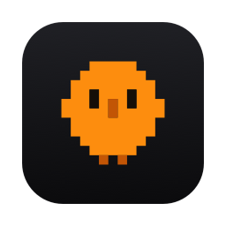
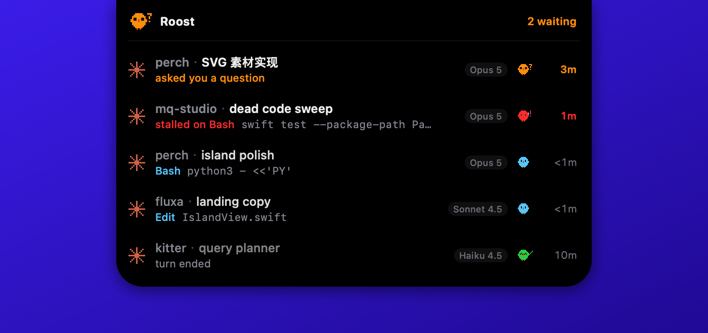
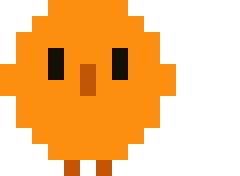
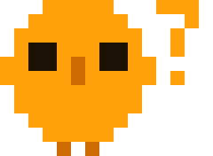
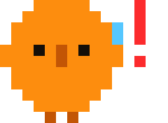
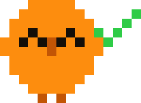
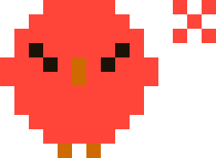
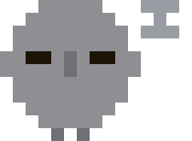
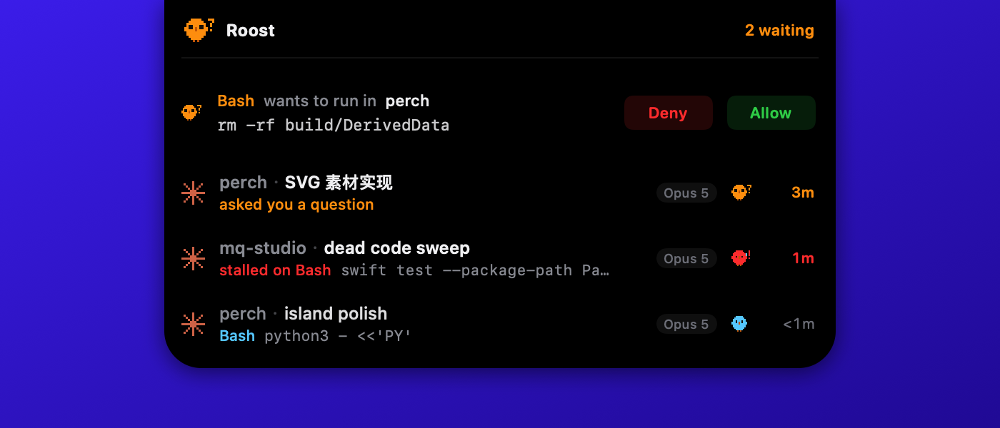
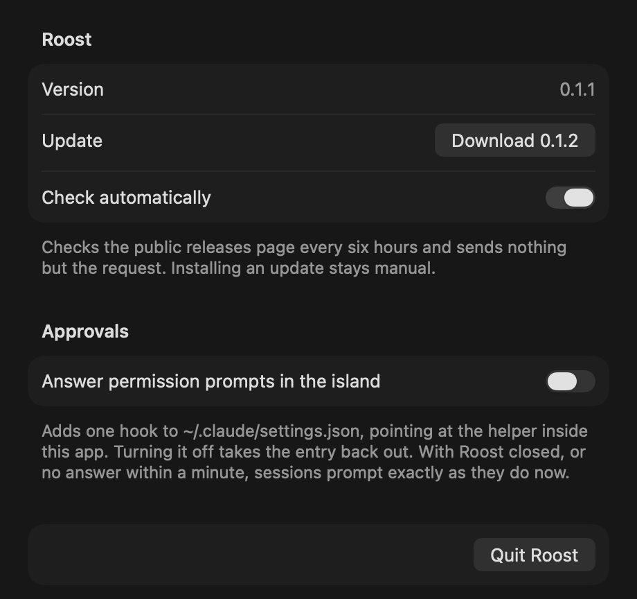

<div align="center">



# Roost

**Your agent sessions, perched on the notch.**

A macOS menu-bar companion that answers one question from the corner of your eye:
*which of my Claude Code sessions has stopped and is waiting on me?*


<a href="https://linux.do/u/amigoer"></a>

**English** · [简体中文](README.zh-CN.md)

</div>



---

## Why

A long agent session does not fail loudly. It asks a question, raises a permission
prompt, or quietly stalls on a tool — and then waits, in a window you tabbed away
from twenty minutes ago. The cost is not the failure; it is the twenty minutes.

Roost keeps exactly that one fact where you already look: the notch. Nothing is
happening? The notch stays the notch. Something needs you? It grows.

## The chick

One mascot, six faces, on a 15×12 pixel grid. The body wears the state's colour,
so a glance answers *what is going on* before any glyph has to be read; the
silhouette and the orange beak carry the identity. The eyes and the badge in the
top-right corner say exactly which state it is.

| | State | Badge | What it means |
|:--:|:--|:--:|:--|
|  | `running` | blue, no badge | Producing output or running a tool. Cool and receding, because work in progress is the least of your worries. Hops one pixel, once per second. |
|  | `waiting` | orange **?** | Stopped on something only you can answer: a question, a plan, a permission prompt. Brand orange is spent here and nowhere else. |
|  | `stalled` | red **!** | A tool call has been outstanding past the grace period. |
|  | `done` | green **✓** | The turn ended. Nothing is burning. |
|  | `error` | red **✕** | Something failed. |
|  | `idle` | grey **z** | Left alone long enough to be clutter. Folded into a single footer line. |

The same mark appears on the collapsed island and on every row of the expanded
list, and the two never disagree. There is deliberately **no menu bar item** —
one more icon up there is the clutter this app exists to remove.

## Anatomy of a row

```
✳  perch · SVG 素材实现                          🐤  3m
   asked you a question
```

| Part | Says |
|:--|:--|
| Agent mark | Whose session it is. One agent today; the slot is there for the day there are more. |
| `project · title` | Which repo, then which conversation. The repo answers "do I care" faster. |
| Second line | What it is doing *right now*: the tool, then the argument a person would recognise — the command, the file, the pattern — pulled straight out of the transcript. Blocked rows say why instead. |
| Model | What it is running, from the desktop app's own record of the session. |
| Mascot | The state, with the badge that says which kind of stop it is. |
| Elapsed | Blocked rows count how long they have been stuck. Everything else counts how long since anything happened, which is what makes a stale session obvious. |

## Answering from the island

A permission prompt can be answered without leaving what you were doing. Roost
installs a `PreToolUse` hook; Claude Code holds the tool call while the hook
asks Roost, and the island shows the call with **Deny** and **Allow**.



Turn it on in Settings — *Answer permission prompts in the island*. That adds
one entry to `~/.claude/settings.json` pointing at the `roost-hook`
binary inside the app bundle. The same switch takes it back out, and hooks that are
not Roost's are never touched.

Failure is deliberately boring. If Roost is not running, if the socket is gone,
if nobody answers within 60 seconds — the hook prints nothing and the session
prompts exactly as it always did. This can make a tool call wait. It cannot
change what one does.

| Tool | Held? |
|:--|:--|
| `Read`, `Grep`, `Glob`, `TodoWrite`, … | Never. Filtered inside the hook, so the common path never pays for a round trip. |
| `Bash`, `WebFetch`, `mcp__*`, everything else | Held — unless the session runs in `bypassPermissions` or `plan`. |
| `Write`, `Edit`, `MultiEdit`, `NotebookEdit` | Held only in `default` mode. An accept-edits session has answered already. |

The island is click-through by design, so the buttons are geometry on both
sides: the card lays them out from the same constants the hit test reads. That
mapping is [tested](Packages/RoostCore/Tests/RoostCoreTests/ApprovalTests.swift),
because clicking the wrong half of a card would answer the wrong question.

## How it reads state

No daemon, no account, no telemetry. Roost reads files you already have:

| Source | Used for |
|:--|:--|
| `~/.claude/sessions/*.json` | Which sessions are live. A registry file outlives its process, so each PID is confirmed against the kernel's own process start time. |
| `~/.claude/projects/**/<id>.jsonl` | The last 256 KB of the transcript: the dangling tool call, the last stop reason, the last semantic timestamp. |
| `~/Library/Application Support/Claude/claude-code-sessions/local_*.json` | Human titles, when the session came from the desktop app. |

Nothing is written to the transcript at the moment a prompt appears, so a
dangling tool call plus elapsed time is the only evidence available:

- `AskUserQuestion` and `ExitPlanMode` are, by definition, waiting on a person —
  they count as blocked the instant they are seen.
- Every other tool gets a **45 second** grace period first, because a long build
  is not a blocked session.
- Transcripts are parsed only when the file's modification date changes; state is
  re-derived from cached facts every tick, so a tool crossing the grace line is
  noticed without re-reading anything.

Sessions that have been `done` for **30 minutes** stop being listed and collapse
into an `N idle` footer.

The one request Roost makes is an update check against GitHub's releases API,
every six hours, sending nothing but the request itself. A newer version puts a
dot on the gear and a line in the footer; installing it stays manual,
because an ad-hoc signed build has no signature worth checking. Switch the check
off under *Check automatically*.

## Escalation

While something is blocked, the island widens on a timer — 60 s, then 300 s. The
badge blinks at one fixed rate throughout, because animation *frequency* is what
disrupts a primary task; width is what peripheral vision actually picks up.

## Design rules

The code enforces these, and the comments say so:

1. **Only blocked grows.** A change of shape at the notch carries exactly one
   meaning and never has to be interpreted.
2. **Hue is the state, the silhouette is the identity.** One colour per state,
   never a gradient of urgency within one; the pixel outline and the orange beak
   are what stay constant.
3. **Nothing is drawn in the cutout.** The camera's rectangle is reserved, always.
4. **Clicks meant for the menu bar are never swallowed.** The panel ignores mouse
   events entirely; hover and clicks come from a global monitor against a hit rect.
5. **Frames are free.** All motion is Core Animation on the render server. A
   `repeatForever` SwiftUI animation re-evaluates the view tree every frame and
   measured at 13–16 % CPU sustained, which an always-on app cannot spend.

## Interaction

- **Hover** the notch to expand the list (up to 6 rows).
- **Click a row** to open that session in the desktop app, by the only handle
  its deep links accept: `claude://code/continue?session=local_…`, the same link
  the app's own menus build. Blocked rows fall back to `needs-input` when the
  session has no desktop record.
- Current desktop builds gate code deep links per account — when the gate is
  shut the app logs `code entry deep link gated off` and merely comes forward.
  Nothing an outside app can change; the link Roost sends is already correct.
- **Click Deny or Allow** on a held tool call. The island stays open on its own
  while one is waiting, so answering never depends on the cursor being there.
- **Click the gear** in the panel's top-right for settings. Right-clicking the
  notch offers the same window plus Quit, which is what to reach for when the
  island is collapsed and there is nothing to point at.
- Displays without a notch get a 185 pt stand-in strip, centred where a notch
  would be.

## Settings



The two things worth choosing live here: whether to check for updates, and
whether to answer permission prompts from the island. It is also the way out —
an accessory app has no Dock icon to quit from.

Nothing here sets the island's state. State is derived from what the sessions
are actually doing, and a switch that overrode it would only ever be lying.

## Install

Take the DMG from [Releases](https://github.com/amigoer/roost/releases) and drag
Roost into Applications. The build is ad-hoc signed rather than notarised, so
macOS refuses the first launch — right-click the app and choose Open, or:

```bash
xattr -dr com.apple.quarantine /Applications/Roost.app
```

Requires macOS 14 or later.

## Build

Requires macOS 14+, Xcode 16 (Swift 6) and [XcodeGen](https://github.com/yonaskolb/XcodeGen).

```bash
brew install xcodegen
xcodegen generate
xcodebuild -project Roost.xcodeproj -scheme Roost -configuration Debug -derivedDataPath build build
open build/Build/Products/Debug/Roost.app
```

Roost is an accessory app: no Dock icon, no window, no menu bar item — just the
island. Right-click the notch to quit.

Run the core tests with:

```bash
swift test --package-path Packages/RoostCore
```

## Layout

```
Sources/RoostApp/
  Notch/       Overlay panel, cutout geometry, global hover monitor
  UI/          Island shape, collapsed strip, session rows, mascot art
  Resources/   App icon, generated from the same pixel grid
Packages/RoostCore/
  Session, SessionState, Escalation, NotchMetrics    pure model
  SessionRegistry, SessionScanner, TranscriptReader  detection, tested
```

`RoostCore` is deliberately free of AppKit so the detection and geometry can be
unit tested without a screen.

## Status

Early. It runs, it detects, it has not been packaged or signed for distribution.

## License

[MIT](LICENSE)
