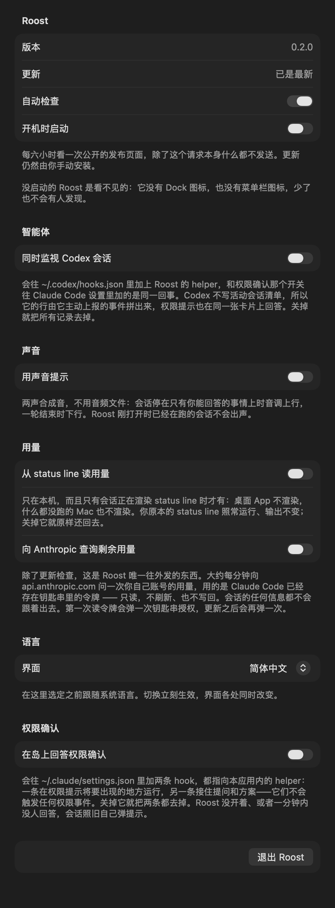

<div align="center">


# Roost

**让你的 agent 会话，栖在刘海上。**

一个 macOS 菜单栏小工具，只用余光就能回答一个问题：
*我的哪个 Claude Code 会话停下来了，正在等我？*


<a href="https://linux.do/u/amigoer"></a>

[English](README.md) · **简体中文**

</div>


---

## 为什么做它

长会话不会大声地失败。它问你一个问题、弹一次权限确认，或者悄悄卡在某个工具上，
然后就一直等着——等在那个你二十分钟前切走的窗口里。真正的代价不是那次中断，
是那二十分钟。

Roost 把这一件事放在你本来就会看的地方：刘海。没事发生时，刘海还是刘海；
有事要你处理时，它会长出来。

## 这只小鸡

一只吉祥物，六个表情，画在 15×12 的像素网格上。身体穿的是状态色——不用读任何图形，
一眼就知道**现在是什么情况**；轮廓和那只橙色的喙负责身份。眼神和右上角的像素徽标
说明具体是哪一种状态。

| | 状态 | 徽标 | 含义 |
|:--:|:--|:--:|:--|
|  | `running` 运行中 | 蓝色，无徽标 | 正在输出或跑工具。冷色后退——干着活恰恰是你最不用操心的事。每秒跳一格像素。 |
|  | `waiting` 等待回复 | 橙色 **?** | 停在只有你能回答的地方：提问、计划确认、权限弹窗。品牌橙只花在这一种状态上。 |
|  | `stalled` 阻塞 | 红色 **!** | 一个工具调用超过宽限期还没回来。 |
|  | `done` 已完成 | 绿色 **✓** | 这一轮结束了，没有什么在烧。 |
|  | `error` 出错 | 红色 **✕** | 出问题了。 |
|  | `idle` 空闲 | 灰色 **z** | 放着太久已经算杂音，收进底部一行。 |

同一个标记出现在收起的岛和展开列表的每一行，两处永远一致。**菜单栏里刻意没有图标**
——上面再多一个图标，正是这个应用想要消灭的杂音。

## 一行里有什么

```
✳  perch · SVG 素材实现                          🐤  3m
   asked you a question
```

| 部件 | 说明 |
|:--|:--|
| Agent 标记 | 这是谁的会话：Claude Code 是八角星芒，Codex 是一个环。用形状区分，因为旁边的吉祥物已经把颜色花在状态上了。 |
| `项目 · 标题` | 先是哪个仓库，再是哪个会话。"关不关我事"这个问题，仓库名回答得更快。 |
| 第二行 | 它**此刻**在干什么：工具名，加上一个人能看懂的参数——命令、文件、匹配模式，直接从转录里取。阻塞的行改成说明为什么停了。 |
| 模型 | 这个会话跑的是哪个模型，取自桌面端自己的会话记录。 |
| 吉祥物 | 状态，以及说明是哪一类停顿的徽标。 |
| 时长 | 阻塞的行数的是卡了多久；其余的数的是距离上次有动静多久——放久了的会话一眼就能认出来。 |

## 在刘海里直接批准

权限确认不用切走就能答。Roost 装一个 `PermissionRequest` hook：Claude Code 把这次工具调用
按住，hook 去问 Roost，岛上就出现这次调用和 **Deny** / **Allow** 两个按钮。


在设置里打开——*在岛上回答权限确认*。它往
`~/.claude/settings.json` 里加两条指向 app 包内 `roost-hook` 的记录；同一个开关
关掉就删除，别人的 hook 一个都不动。

失败路径故意做得很无聊：Roost 没在跑、socket 不在、60 秒没人答——hook 什么都不输出，
会话就按它原来的方式弹窗。它可以让一次工具调用多等一会儿，但改不了这次调用的结果。

| 事件 | 带来什么 |
|:--|:--|
| `PermissionRequest` | 每一次将要弹出确认的工具调用——不管是什么工具，也不管这个会话是什么权限模式。除此之外没有别的东西会触发它；根本没法弹确认的会话（`claude -p`）也完全不会触发它——那种会话不等任何人，它自己失败掉，本来就不该出现在岛上。 |
| `PreToolUse` | 只有 `AskUserQuestion` 和 `ExitPlanMode`：这两次调用会让会话停住，但它们根本不是权限，没有任何权限事件会为它们触发。它带来的其余调用都在 hook 里就丢掉了，常规路径只花一次集合查找，不跨进程。 |

`PermissionRequest` 只在确认将要出现的地方运行，别处都不运行，所以到达岛上的
**就是**一次确认。没有什么要推断，也没有什么要过滤。

早先的版本只有 `PreToolUse`，它对每一次调用都触发，不管这次会不会弹确认，
于是只能去磁盘上读每个会话的权限模式来补这个差——先读 transcript（每一轮的模式都在里面），
读不到再退回桌面端的会话记录——然后据此猜。这个猜没有了，
连同"为一次根本不会被问到的调用弹出卡片"这一整类问题一起没有了。

有调用被按住的时候，那个会话自己的行会直接写明白，而不是看起来还在忙：
**需要授权：Bash**；如果这次调用来自子 agent 内部而不是主线程，就写成
**general-purpose 需要输入**。事件恰好只在这一种情况下带上 `agent_id` 和
`agent_type`，别的时候都不带，这一行就是靠它区分两者的。Claude Code 弹确认的
那一刻不往 transcript 里写任何东西，所以只有 hook 知道这件事——否则那一行和
顶上的总览都会把这个会话算成运行中。

岛本身是穿透的，所以按钮在两边都是几何：卡片按照命中测试读的同一组常量排版。
这个映射[有测试](Packages/RoostCore/Tests/RoostCoreTests/ApprovalTests.swift)保着，
因为点错卡片的哪一半，就等于答错了问题。

### 提问和方案

同一个 hook 还带回另外两种会让会话停住的事，它们都不是权限。

**提问。** `AskUserQuestion` 带着选项一起过来，卡片把它们排成一行行，点一个就答完了。
hook 的返回里没有"这是答案"这种决定，所以这一下是以「拒绝」的形式发回去的，
理由就是被选中的那个标签——而理由正是模型接下来读到的东西。任何权限模式下都会按住，
因为没有哪种模式能替你回答问题：`bypassPermissions` 只是跳过确认，它不能决定
你说的是哪个部署环境。卡片答不完整的一律不碰——一次问好几个问题、多选、
某个选项读不出来——都交回去按原样弹。

**方案。** `ExitPlanMode` 带着方案过来，卡片显示它的开头，加上 **修改** 和 **通过**。
通过就是放这次调用过去，这正是终端里那个方案确认在做的事；修改则是拒绝它，
把会话留在 plan 模式里，并附上一句"去问要改什么"——岛上没地方打字，
与其编一段反馈，不如直说。

显示六行拍平的文本而不是渲染 markdown：在这个宽度上，标题层级占的地方比它带来的
信息多，所以这些标记全省下来换成方案本身的字。卡片会说明还有多少行没显示，
完整的方案在对话里。

### 不止一个 agent

Codex 说的是同一套 hook 协议——一样的事件名、一样的载荷字段，只是文件放在别处——
所以同一个 helper 也能替它干活，只要告诉它这次代表谁。在*智能体*里打开。

权限这块是完全一样的：同一个 `PermissionRequest` 事件、同一张卡片、
同一个 `{"behavior": …}` 形状的答案。Codex 没有 `AskUserQuestion`，也没有 plan 模式，
所以它的 `PreToolUse` 用在别的地方。

不一样的是围绕权限的那一圈。Codex 既不写活动会话清单，也没有一份能说明"此刻在干什么"
的转录，所以它的行是用它主动上报的事件拼出来的——开始了、收到指令、去调工具、结束了——
而不是从磁盘上读来的。调完工具之后没有下文的，按转录同样的宽限期算作卡住。

## 它怎么判断状态

没有常驻守护进程，不需要账号，不上报任何东西。Roost 只读你本来就有的文件：

| 来源 | 用途 |
|:--|:--|
| `~/.claude/sessions/*.json` | 哪些会话还活着。注册文件会比进程活得久，所以每个 PID 都要和内核记录的进程启动时间对上才算数。 |
| `~/.claude/projects/**/<id>.jsonl` | 转录文件末尾 256 KB：悬空的工具调用、最后的 stop reason、最后一条语义时间戳。 |
| `~/Library/Application Support/Claude/claude-code-sessions/local_*.json` | 会话标题，桌面端发起的会话才有。 |

权限弹窗出现的那一刻，转录里什么都不会写，所以“悬空的工具调用 + 已等待时长”
是唯一可用的证据：

- `AskUserQuestion` 和 `ExitPlanMode` 按定义就是在等人，一看见就直接算阻塞。
- 其他工具先给 **45 秒**宽限期——一次慢编译不等于一个卡住的会话。
- 只有文件修改时间变了才重新解析转录；状态每一拍都从缓存的事实重新推导，
  所以工具跨过宽限线这件事不需要重读任何文件就能发现。

`done` 状态超过 **30 分钟**的会话不再单独列出，折叠成底部的 `N idle` 一行。
只靠 hook 才知道的会话，安静满 **12 小时**就忘掉——被杀掉而不是正常关闭的 agent
不会发 `SessionEnd`。

### 用量窗口

五小时和七天这两个数字只会出现在 status line 里，这台机器上别处都没有——转录里没有，
统计缓存里也没有——所以想读到它，就得站在那条路上。在*用量*里打开之后，Roost 会装一个
status line 命令，它**包住**你原本配置的那个：同一份载荷送进它的 stdin，
它的输出原样打出来，而 Roost 写进去的那条记录把原来的整条用 base64 带在自己的参数里。
再关掉就把原来的原样还回去，只靠设置文件本身，Roost 开着没开着都一样。

两个窗口在底部各占一条进度条。只有五小时那个会显示倒计时，而且只在紧到"什么时候恢复"
比"用了多少"更有用的时候才显示。最后一次上报满十五分钟后这个数字就不再显示了，
因为最后一个会话关掉之后，就没有人再写 status line 了。

Roost 唯一发出的请求是每 6 小时向 GitHub 的 releases API 查一次有没有新版本，
除了请求本身不带任何信息。有新版时齿轮上出现一个点、底部多一行提示；
安装仍然是手动的——ad-hoc 签名的包没有值得校验的签名，不该自己覆盖自己。
不想要的话在菜单里关掉 *Check automatically*。

## 声音

两声提示音，默认关着。用合成的方波而不是打包音频文件，理由和吉祥物是像素网格一样：
这是这个应用本来就在说的话，而且三分之一秒的东西没人想要一段采样。

音高承担含义——会话停在只有人能回答的事情上时音调上行，一轮结束时下行——
所以隔着一个房间不用细听也分得出是哪一种。两个都压得离满量程很远：
一个需要调低音量的提示音，最后一定会被彻底关掉。

判断来自两次扫描之间的差，而不是来自事件，所以一个会话在两种阻塞之间挪动是不出声的；
启动后的第一份快照也完全不出声——里面的一切在 Roost 打开之前就已经是那样了。

## 升级策略

有会话阻塞时，岛会按 60 秒、300 秒两档变宽。徽标的闪烁频率全程不变——
因为真正打断主任务的是动画*频率*，而余光能捕捉到的是宽度。

## 设计约束

这些约束写在代码里，注释里也说明了原因：

1. **只有阻塞才会变大。** 刘海形状的改变只承载一个含义，永远不需要被解读。
2. **颜色表示状态，轮廓表示身份。** 一个状态一种颜色，同一状态内部不会再用颜色
   分级；保持不变的是像素轮廓和那只橙色的喙。
3. **绝不在挖孔区域作画。** 摄像头那块矩形永远留空。
4. **绝不吞掉本该给菜单栏的点击。** 面板完全忽略鼠标事件，悬停和点击来自
   全局监听器对命中矩形的判断。
5. **帧是免费的。** 所有动效都是跑在渲染服务上的 Core Animation。SwiftUI 的
   `repeatForever` 会每帧重算视图树，实测持续占用 13–16% CPU，常驻应用付不起。

## 交互

- **悬停**刘海展开列表（最多 6 行）。
- **点击任意一行**去到这个会话真正所在的地方。会话本身是个没有窗口的 CLI 进程，
  所以 Roost 顺着它的进程树往上爬：第一个被 macOS 当作"正在运行的应用"的祖先进程，
  就是它待着的那个窗口——Terminal、iTerm2、Ghostty、Warp、编辑器自带的终端都算。
  中间那些 shell 和 helper 按 activation policy 跳过，正因如此这件事不需要维护
  一张终端名单。
- **桌面端**开的对话能做得比"把窗口叫到前面"更好，所以它仍然走
  `claude://resume?session=…`——外部唯一能用的
  路由。它的行为完全取决于传进去的 id：它会把 `local_` 前缀拼回去，聚焦找到的那条
  记录。传**桌面端自己的会话 id** 就落在原会话上；传 CLI session id 则匹配不到桌面端
  自己创建的那条，于是把转录导入成旁边的第二条——而那条副本是独立会话，被打开时会
  再起一个进程去读同一份转录。所以只要有桌面记录，Roost 就传它自己的 id；只有在
  完全没有记录时（终端里起的会话）才传 CLI id，那里导入正是它进入桌面端的方式。
- 另外两条路由 `code/continue` 和 `code/needs-input` 同样吃桌面 id，但挂着账号级
  gate，只会在日志里写 `code entry deep link gated off`，什么都不做。
- **点 Deny 或 Allow** 回答被按住的工具调用，**点某个选项**回答提问，
  **点修改或通过**给方案定论。有卡片在等的时候岛会自己保持展开，
  不需要鼠标一直停在那儿。
- **点面板右上角的齿轮**打开设置。右键点击刘海给的是同一个窗口外加"退出"——
  岛收起、没东西可点的时候用这个。
- 没有刘海的显示器会得到一条 185 pt 的替代条，位置就在刘海本该在的地方。

## 设置



所有值得你做选择的东西都在这里，每个开关下面都有一句话说明它到底干了什么：
要不要检查更新、要不要开机启动、界面说哪种语言、要不要在岛上回答权限确认、
要不要连 Codex 一起看着、状态变化要不要出声、以及要不要为了用量窗口去站在
status line 那条路上。**退出也在这里**——accessory 应用没有 Dock 图标可以退。

每一个会动到文件的开关，写进去和拿出来都是叠加式的：不是 Roost 的 hook 一律不碰，
不是 Roost 的 status line 是包住而不是替掉。

语言默认跟随系统，也可以自己选 English 或简体中文。切换立刻生效，岛上一起变。

这里没有任何东西可以设置岛的状态。状态是从会话实际在做什么推导出来的，
一个能覆盖它的开关只会撒谎。

## 安装

从 [Releases](https://github.com/amigoer/roost/releases) 下载 DMG，把 Roost 拖进
Applications。构建是 ad-hoc 签名而非公证过的，所以 macOS 会拦第一次启动——右键
选"打开"，或者：

```bash
xattr -dr com.apple.quarantine /Applications/Roost.app
```

需要 macOS 14 或更高版本。

## 构建

需要 macOS 14+、Xcode 16（Swift 6）和 [XcodeGen](https://github.com/yonaskolb/XcodeGen)。

```bash
brew install xcodegen
xcodegen generate
xcodebuild -project Roost.xcodeproj -scheme Roost -configuration Debug -derivedDataPath build build
open build/Build/Products/Debug/Roost.app
```

Roost 是 accessory 应用：没有 Dock 图标，没有窗口，菜单栏里也没有图标——只有那个岛。
退出请右键点击刘海。

跑核心测试：

```bash
swift test --package-path Packages/RoostCore
```

## 目录结构

```
Sources/RoostApp/
  Notch/       覆盖面板、挖孔几何、全局悬停监听
  UI/          岛形状、收起条、会话行、卡片、吉祥物美术
  Settings/    唯一的窗口，也是退出应用的唯一入口
  Approvals/   helper 连过来的那个 socket
  Resources/   App 图标，由同一份像素网格生成
Sources/RoostHook/
  一个 helper 三种活，靠参数区分：按住一次 Claude Code 调用、
  替另一个 agent 出面、或者转发一份 status line 载荷。
Packages/RoostCore/
  Session、SessionState、Escalation、NotchMetrics     纯模型
  SessionRegistry、SessionScanner、TranscriptReader   检测逻辑，带测试
  Approval、HookInstall、StatusLineInstall            协议与文件
  Usage、Chirp、Announcer、PlanPreview                岛上说的话
```

`RoostCore` 刻意不依赖 AppKit，这样检测和几何计算不需要屏幕就能做单元测试。

## 项目状态

早期阶段。能跑、能检测，但还没有做分发打包和签名。

## 许可证

[MIT](LICENSE)
